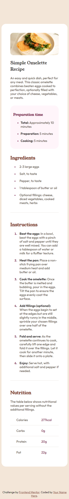

# Frontend Mentor - Recipe page solution

This is a solution to the [Recipe page challenge on Frontend Mentor](https://www.frontendmentor.io/challenges/recipe-page-KiTsR8QQKm). Frontend Mentor challenges help you improve your coding skills by building realistic projects. 

# Frontend Mentor - Recipe page

## Table of contents

- [Overview](#overview)
  - [The challenge](#the-challenge)
  - [Screenshot](#screenshot)
  - [Links](#links)
- [My process](#my-process)
  - [Built with](#built-with)
  - [Useful resources](#useful-resources)
- [Author](#author)

## Overview

### Screenshot

- Desktop Screenshot

- Mobile Screenshot

### Links

- Frontend Mentor Solution URL: [Frontend Mentor Solution Page](https://www.frontendmentor.io/solutions/recipe-page-using-semantic-html-and-css-custom-properties-gDUazR5dfo)

- Live Site URL: [Live Hosted Website](https://mharvel13.github.io/Recipe-Page/)

- Github Solution URL: [Github Hosted Codes](https://github.com/Mharvel13/Recipe-Page)

## My process

### Built with

- Semantic HTML5 markup
- CSS custom properties
- Flexbox
- Mobile-first workflow

### Useful resources

- [How to add border to tables](https://www.w3schools.com/html/html_table_borders.asp) - This helped me for table borders.

- [How to style list/bullets](https://www.w3schools.com/howto/howto_css_bullet_color.asp) - This is an amazing article which helped me finally understand how to style bullet points and list markers. I'd recommend it to anyone still learning this concept.

## Author

- GitHub Profile - [Mharvel13](https://github.com/Mharvel13)
- Frontend Mentor - [Marvel Victor](https://www.frontendmentor.io/profile/Mharvel13)
- Twitter - [Marvel](https://twitter.com/Mharvel_O)
